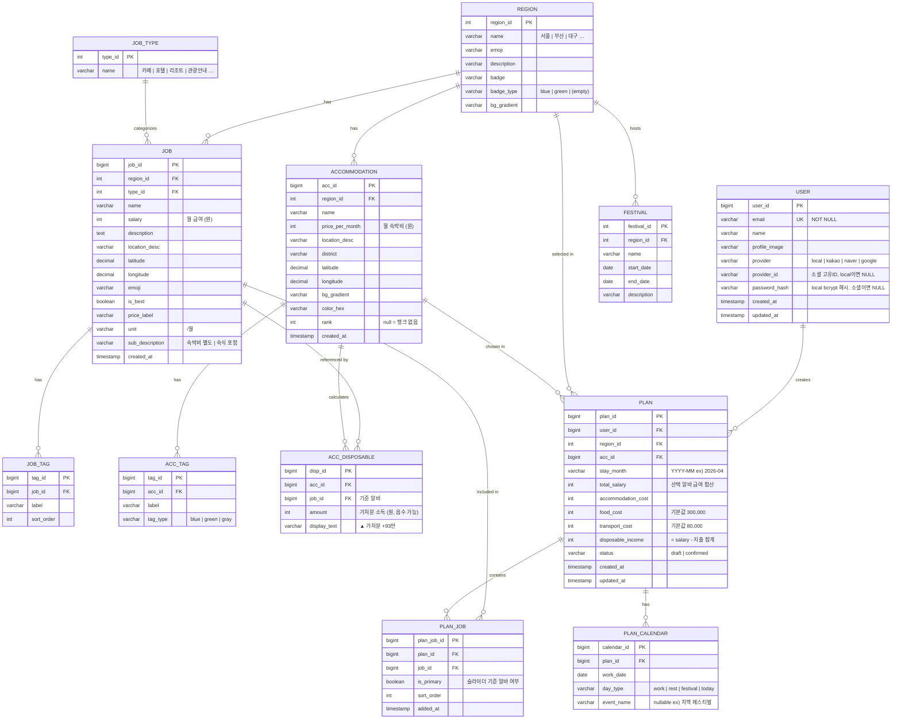

# 삼터 (Samteo) ERD

## Entity Relationship Diagram



---

## 테이블 정의

### USER
일반(ID/PW) 및 소셜 로그인을 단일 테이블로 관리.

| 컬럼 | 타입 | 설명 |
|------|------|------|
| user_id | BIGINT PK | 자동증가 |
| email | VARCHAR(255) NOT NULL UNIQUE | 로그인 식별자. 소셜도 이메일로 기존 계정 탐색 |
| name | VARCHAR(100) | 표시 이름 |
| profile_image | VARCHAR(500) | 프로필 이미지 URL |
| provider | ENUM('local','kakao','naver','google') | 가입 경로 |
| provider_id | VARCHAR(255) | 소셜 제공사 고유 ID, local이면 NULL |
| password_hash | VARCHAR(255) | bcrypt 해시, 소셜이면 NULL |
| created_at | TIMESTAMP | 가입일 |
| updated_at | TIMESTAMP | 마지막 수정일 |

**인덱스**
```sql
UNIQUE KEY uq_provider (provider, provider_id)  -- 동일 소셜 계정 중복 방지
```

**예시 데이터**

| user_id | email | provider | provider_id | password_hash |
|---------|-------|----------|-------------|---------------|
| 1 | user@email.com | local | NULL | `$2b$10$...` |
| 2 | kakao@email.com | kakao | 1234567890 | NULL |
| 3 | google@email.com | google | google_uid_abc | NULL |

**로그인 쿼리**
```sql
-- 일반 로그인: email로 조회 후 password_hash bcrypt 검증
SELECT * FROM USER WHERE email = ? AND provider = 'local';

-- 소셜 로그인: provider + provider_id로 조회, 없으면 신규 가입
SELECT * FROM USER WHERE provider = 'kakao' AND provider_id = ?;
```

---

### REGION
선택 가능한 체류 지역 (서울, 부산, 대구 등 12개).

| 컬럼 | 타입 | 설명 |
|------|------|------|
| region_id | INT PK | |
| name | VARCHAR(30) | 지역명 |
| emoji | VARCHAR(10) | 이모지 |
| description | VARCHAR(200) | 소개 문구 |
| badge | VARCHAR(30) | 뱃지 텍스트 (nullable) |
| badge_type | VARCHAR(10) | blue / green / (빈 문자열) |
| bg_gradient | VARCHAR(200) | CSS linear-gradient 값 |

---

### JOB_TYPE
알바 업종 분류.

| 컬럼 | 타입 | 설명 |
|------|------|------|
| type_id | INT PK | |
| name | VARCHAR(30) | 카페 / 호텔 / 리조트 / 관광안내 / 문화관광 / 레저 / 시장 / 면세점 / 행사 / 숙박 / 편의점 / 물류 / 판매 / 농업 |

---

### JOB
체류지 알바 공고. 출퇴근 1시간 이내 필터링 완료 기준.

| 컬럼 | 타입 | 설명 |
|------|------|------|
| job_id | BIGINT PK | |
| region_id | INT FK | 해당 지역 |
| type_id | INT FK | 업종 |
| name | VARCHAR(100) | 공고명 |
| salary | INT | 월 급여 (원) |
| description | TEXT | 상세 설명 |
| location_desc | VARCHAR(150) | 📍 위치 + 소요시간 텍스트 |
| latitude | DECIMAL(10,7) | 위도 |
| longitude | DECIMAL(10,7) | 경도 |
| emoji | VARCHAR(10) | 대표 이모지 |
| is_best | BOOLEAN | BEST 뱃지 여부 |
| price_label | VARCHAR(20) | ₩170만 형태 표시용 |
| unit | VARCHAR(10) | /월 |
| sub_description | VARCHAR(50) | 숙박비 별도 / 숙식 포함 |
| created_at | TIMESTAMP | |

---

### JOB_TAG
알바 카드에 표시되는 태그 (🚇 지하철 직결, ⏰ 주 5일 등).

| 컬럼 | 타입 | 설명 |
|------|------|------|
| tag_id | BIGINT PK | |
| job_id | BIGINT FK | |
| label | VARCHAR(50) | 태그 텍스트 |
| sort_order | INT | 표시 순서 |

---

### ACCOMMODATION
추천 숙소 정보.

| 컬럼 | 타입 | 설명 |
|------|------|------|
| acc_id | BIGINT PK | |
| region_id | INT FK | 해당 지역 |
| name | VARCHAR(100) | 숙소명 |
| price_per_month | INT | 월 숙박비 (원) |
| location_desc | VARCHAR(150) | 위치 + 교통 설명 |
| district | VARCHAR(30) | 행정구 (중구, 수성구 …) |
| latitude | DECIMAL(10,7) | 위도 |
| longitude | DECIMAL(10,7) | 경도 |
| bg_gradient | VARCHAR(200) | 카드 배경 CSS |
| color_hex | VARCHAR(10) | 지도 마커 색상 |
| rank | INT | 추천 순위 (nullable) |
| created_at | TIMESTAMP | |

---

### ACC_TAG
숙소 태그 (숙소 별도, 지하철 12분 등).

| 컬럼 | 타입 | 설명 |
|------|------|------|
| tag_id | BIGINT PK | |
| acc_id | BIGINT FK | |
| label | VARCHAR(50) | |
| tag_type | VARCHAR(10) | blue / green / gray |

---

### ACC_DISPOSABLE
알바-숙소 조합별 가처분 소득 사전 계산값.

| 컬럼 | 타입 | 설명 |
|------|------|------|
| disp_id | BIGINT PK | |
| acc_id | BIGINT FK | 숙소 |
| job_id | BIGINT FK | 알바 |
| amount | INT | 가처분 소득 (원, 음수 가능) |
| display_text | VARCHAR(30) | ▲ 가처분 +93만 형태 표시용 |

---

### PLAN
사용자가 구성한 한달살기 플랜.

| 컬럼 | 타입 | 설명 |
|------|------|------|
| plan_id | BIGINT PK | |
| user_id | BIGINT FK | 작성자 |
| region_id | INT FK | 체류 지역 |
| acc_id | BIGINT FK | 선택 숙소 |
| stay_month | VARCHAR(7) | 체류 월 (YYYY-MM) |
| total_salary | INT | 선택 알바 급여 합산 |
| accommodation_cost | INT | 숙박비 |
| food_cost | INT | 식비 (기본 300,000) |
| transport_cost | INT | 교통비 (기본 80,000) |
| disposable_income | INT | 실수령액 |
| status | VARCHAR(10) | draft / confirmed |
| created_at | TIMESTAMP | |
| updated_at | TIMESTAMP | |

---

### PLAN_JOB
플랜에 포함된 알바 목록 (M:N).

| 컬럼 | 타입 | 설명 |
|------|------|------|
| plan_job_id | BIGINT PK | |
| plan_id | BIGINT FK | |
| job_id | BIGINT FK | |
| is_primary | BOOLEAN | 슬라이더 첫 번째(기준) 알바 여부 |
| sort_order | INT | 슬라이더 표시 순서 |
| added_at | TIMESTAMP | |

---

### PLAN_CALENDAR
플랜의 일별 캘린더 일정.

| 컬럼 | 타입 | 설명 |
|------|------|------|
| calendar_id | BIGINT PK | |
| plan_id | BIGINT FK | |
| work_date | DATE | 날짜 |
| day_type | VARCHAR(10) | work / rest / festival / today |
| event_name | VARCHAR(100) | 이벤트명 (nullable) |

---

### FESTIVAL
지역 축제 데이터 (캘린더 자동 배치용).

| 컬럼 | 타입 | 설명 |
|------|------|------|
| festival_id | INT PK | |
| region_id | INT FK | 개최 지역 |
| name | VARCHAR(100) | 축제명 |
| start_date | DATE | 시작일 |
| end_date | DATE | 종료일 |
| description | VARCHAR(300) | 설명 |

---

## CREATE TABLE

```sql
-- ① 독립 테이블 먼저

CREATE TABLE USER (
    user_id        BIGINT          NOT NULL AUTO_INCREMENT,
    email          VARCHAR(255)    NOT NULL,
    name           VARCHAR(100)    NOT NULL,
    profile_image  VARCHAR(500),
    provider       ENUM('local','kakao','naver','google') NOT NULL DEFAULT 'local',
    provider_id    VARCHAR(255),
    password_hash  VARCHAR(255),
    created_at     TIMESTAMP       NOT NULL DEFAULT CURRENT_TIMESTAMP,
    updated_at     TIMESTAMP       NOT NULL DEFAULT CURRENT_TIMESTAMP ON UPDATE CURRENT_TIMESTAMP,
    PRIMARY KEY (user_id),
    UNIQUE KEY uq_email     (email),
    UNIQUE KEY uq_provider  (provider, provider_id)
);

CREATE TABLE REGION (
    region_id    INT             NOT NULL AUTO_INCREMENT,
    name         VARCHAR(30)     NOT NULL,
    emoji        VARCHAR(10)     NOT NULL,
    description  VARCHAR(200),
    badge        VARCHAR(30),
    badge_type   VARCHAR(10),
    bg_gradient  VARCHAR(200),
    PRIMARY KEY (region_id),
    UNIQUE KEY uq_region_name (name)
);

CREATE TABLE JOB_TYPE (
    type_id  INT          NOT NULL AUTO_INCREMENT,
    name     VARCHAR(30)  NOT NULL,
    PRIMARY KEY (type_id),
    UNIQUE KEY uq_type_name (name)
);

CREATE TABLE FESTIVAL (
    festival_id  INT           NOT NULL AUTO_INCREMENT,
    region_id    INT           NOT NULL,
    name         VARCHAR(100)  NOT NULL,
    start_date   DATE          NOT NULL,
    end_date     DATE          NOT NULL,
    description  VARCHAR(300),
    PRIMARY KEY (festival_id),
    CONSTRAINT fk_festival_region FOREIGN KEY (region_id) REFERENCES REGION (region_id)
);

-- ② REGION, JOB_TYPE 참조

CREATE TABLE JOB (
    job_id           BIGINT          NOT NULL AUTO_INCREMENT,
    region_id        INT             NOT NULL,
    type_id          INT             NOT NULL,
    name             VARCHAR(100)    NOT NULL,
    salary           INT             NOT NULL,
    description      TEXT,
    location_desc    VARCHAR(150),
    latitude         DECIMAL(10,7),
    longitude        DECIMAL(10,7),
    emoji            VARCHAR(10),
    is_best          BOOLEAN         NOT NULL DEFAULT FALSE,
    price_label      VARCHAR(20),
    unit             VARCHAR(10)     DEFAULT '/월',
    sub_description  VARCHAR(50),
    created_at       TIMESTAMP       NOT NULL DEFAULT CURRENT_TIMESTAMP,
    PRIMARY KEY (job_id),
    CONSTRAINT fk_job_region   FOREIGN KEY (region_id) REFERENCES REGION   (region_id),
    CONSTRAINT fk_job_type     FOREIGN KEY (type_id)   REFERENCES JOB_TYPE (type_id)
);

CREATE TABLE ACCOMMODATION (
    acc_id           BIGINT          NOT NULL AUTO_INCREMENT,
    region_id        INT             NOT NULL,
    name             VARCHAR(100)    NOT NULL,
    price_per_month  INT             NOT NULL,
    location_desc    VARCHAR(150),
    district         VARCHAR(30),
    latitude         DECIMAL(10,7),
    longitude        DECIMAL(10,7),
    bg_gradient      VARCHAR(200),
    color_hex        VARCHAR(10),
    rank             INT,
    created_at       TIMESTAMP       NOT NULL DEFAULT CURRENT_TIMESTAMP,
    PRIMARY KEY (acc_id),
    CONSTRAINT fk_acc_region FOREIGN KEY (region_id) REFERENCES REGION (region_id)
);

-- ③ JOB, ACCOMMODATION 참조

CREATE TABLE JOB_TAG (
    tag_id      BIGINT       NOT NULL AUTO_INCREMENT,
    job_id      BIGINT       NOT NULL,
    label       VARCHAR(50)  NOT NULL,
    sort_order  INT          NOT NULL DEFAULT 0,
    PRIMARY KEY (tag_id),
    CONSTRAINT fk_job_tag_job FOREIGN KEY (job_id) REFERENCES JOB (job_id) ON DELETE CASCADE
);

CREATE TABLE ACC_TAG (
    tag_id    BIGINT       NOT NULL AUTO_INCREMENT,
    acc_id    BIGINT       NOT NULL,
    label     VARCHAR(50)  NOT NULL,
    tag_type  VARCHAR(10)  NOT NULL DEFAULT 'gray',
    PRIMARY KEY (tag_id),
    CONSTRAINT fk_acc_tag_acc FOREIGN KEY (acc_id) REFERENCES ACCOMMODATION (acc_id) ON DELETE CASCADE
);

CREATE TABLE ACC_DISPOSABLE (
    disp_id       BIGINT       NOT NULL AUTO_INCREMENT,
    acc_id        BIGINT       NOT NULL,
    job_id        BIGINT       NOT NULL,
    amount        INT          NOT NULL,
    display_text  VARCHAR(30),
    PRIMARY KEY (disp_id),
    UNIQUE KEY uq_acc_job (acc_id, job_id),
    CONSTRAINT fk_disp_acc FOREIGN KEY (acc_id) REFERENCES ACCOMMODATION (acc_id) ON DELETE CASCADE,
    CONSTRAINT fk_disp_job FOREIGN KEY (job_id) REFERENCES JOB           (job_id) ON DELETE CASCADE
);

-- ④ USER, REGION, ACCOMMODATION 참조

CREATE TABLE PLAN (
    plan_id              BIGINT       NOT NULL AUTO_INCREMENT,
    user_id              BIGINT       NOT NULL,
    region_id            INT          NOT NULL,
    acc_id               BIGINT       NOT NULL,
    stay_month           CHAR(7)      NOT NULL COMMENT 'YYYY-MM',
    total_salary         INT          NOT NULL DEFAULT 0,
    accommodation_cost   INT          NOT NULL DEFAULT 0,
    food_cost            INT          NOT NULL DEFAULT 300000,
    transport_cost       INT          NOT NULL DEFAULT 80000,
    disposable_income    INT          NOT NULL DEFAULT 0,
    status               ENUM('draft','confirmed') NOT NULL DEFAULT 'draft',
    created_at           TIMESTAMP    NOT NULL DEFAULT CURRENT_TIMESTAMP,
    updated_at           TIMESTAMP    NOT NULL DEFAULT CURRENT_TIMESTAMP ON UPDATE CURRENT_TIMESTAMP,
    PRIMARY KEY (plan_id),
    CONSTRAINT fk_plan_user   FOREIGN KEY (user_id)    REFERENCES USER          (user_id),
    CONSTRAINT fk_plan_region FOREIGN KEY (region_id)  REFERENCES REGION        (region_id),
    CONSTRAINT fk_plan_acc    FOREIGN KEY (acc_id)     REFERENCES ACCOMMODATION (acc_id)
);

-- ⑤ PLAN, JOB 참조

CREATE TABLE PLAN_JOB (
    plan_job_id  BIGINT     NOT NULL AUTO_INCREMENT,
    plan_id      BIGINT     NOT NULL,
    job_id       BIGINT     NOT NULL,
    is_primary   BOOLEAN    NOT NULL DEFAULT FALSE,
    sort_order   INT        NOT NULL DEFAULT 0,
    added_at     TIMESTAMP  NOT NULL DEFAULT CURRENT_TIMESTAMP,
    PRIMARY KEY (plan_job_id),
    UNIQUE KEY uq_plan_job (plan_id, job_id),
    CONSTRAINT fk_planjob_plan FOREIGN KEY (plan_id) REFERENCES PLAN (plan_id) ON DELETE CASCADE,
    CONSTRAINT fk_planjob_job  FOREIGN KEY (job_id)  REFERENCES JOB  (job_id)
);

CREATE TABLE PLAN_CALENDAR (
    calendar_id  BIGINT       NOT NULL AUTO_INCREMENT,
    plan_id      BIGINT       NOT NULL,
    work_date    DATE         NOT NULL,
    day_type     ENUM('work','rest','festival','today') NOT NULL DEFAULT 'work',
    event_name   VARCHAR(100),
    PRIMARY KEY (calendar_id),
    UNIQUE KEY uq_plan_date (plan_id, work_date),
    CONSTRAINT fk_cal_plan FOREIGN KEY (plan_id) REFERENCES PLAN (plan_id) ON DELETE CASCADE
);
```

---

## 주요 비즈니스 로직

| 항목 | 계산식 |
|------|--------|
| 가처분 소득 | `total_salary - accommodation_cost - food_cost - transport_cost` |
| 기본 고정 지출 | 식비 ₩300,000 + 교통비 ₩80,000 = **₩380,000** |
| 다중 알바 합산 | `PLAN_JOB` 에 연결된 `JOB.salary` 전체 합산 → `PLAN.total_salary` |
| 캘린더 자동 배치 | 체류 월 + `FESTIVAL` 기간 겹침 여부 → `PLAN_CALENDAR.day_type = 'festival'` |
